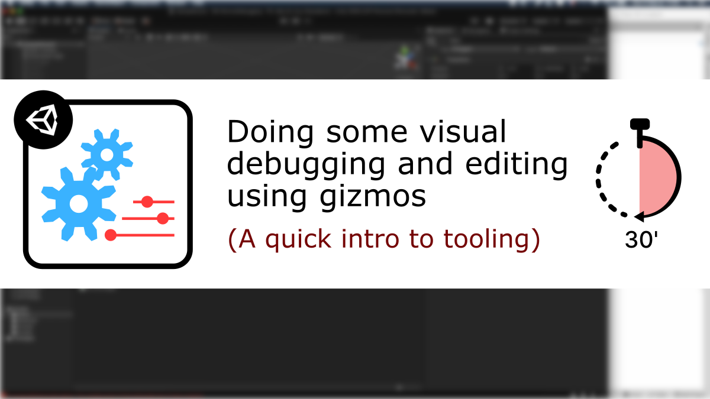
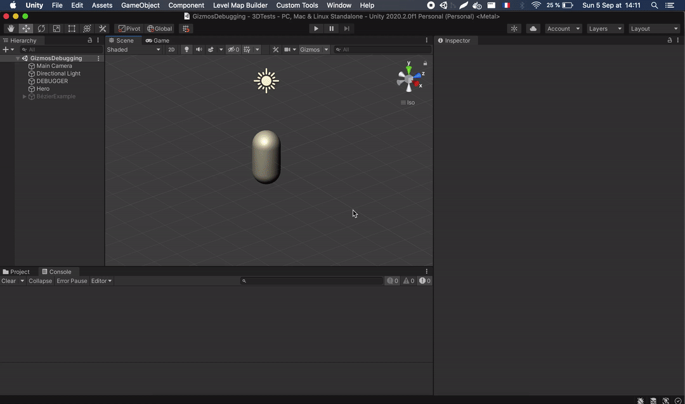

# [Unity/C#] Visual debugging and editing using gizmos

**Mina Pêcheux - September 2021**

How can we use Unity built-in editor features to create our own tools and improve the debugging or editing of our game data? Let's discover more in this video/text tutorial: "How to do visual debugging and editing using gizmos in less than 30 minutes" :)

You can read it in text format [on Medium](https://medium.com/p/how-to-use-math-noises-for-procedural-generation-in-unity-c-44902a21d8e), or watch it [on Youtube](https://www.youtube.com/watch?v=q3X98YKf0I8).

In this less than 30 minutes-tutorial, I'm discussing tooling in Unity, why it's important and how we can use scene gizmos or custom editors to better analyze and tweak our project data!

This Github repo contains the various examples presented in the tutorial, plus a more advanced `HeroDebugger` script to go further. This advanced version uses **C# reflection** to automatically list the float fields available in the `HeroManager` data class, show them as a popup and even match them to specific debug colors :)

